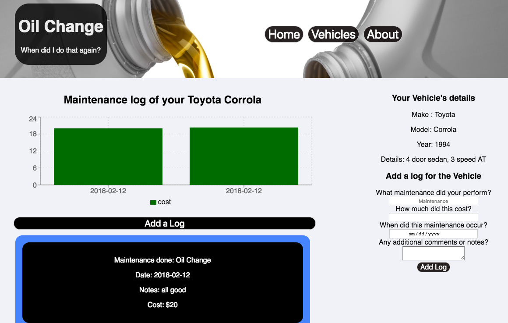

# Oil Change
#### If you have ever forgotten when you changed the oil, simply ran out of room or lost your maintenance log book. Dont worry you are not alone, and fortunately there is Oil Change, an app that will be the maintenance log book in your pocket. 

#### All you need to do is just pick out or add your car, and we will pull up the last time you did any service to your car. 

#### Here you can view, add, edit, or delete your maintenance logs. We also show you a bar chart of your data to give a time line of when you last did your maintenance and the Cost. It is simple to use, fill out a form and we will do the rest. Do an oil change? Change the air Filter? Just fill out a log entry and we will keep a record for you.

### You can find Oil Change deployed [here](https://oilchange.herokuapp.com).   

## Technology used in Oil Change
#### Oil Change is a front end React App and on the server side was built with Node.js, Express, and Postgresql.You will find the Github repository for the server side of Oil Change [here](https://github.com/dhausk/backendOilChange).

## Want to improve Oil Change?

#### To install locally make sure the the API server is running and that cors and fetch request urls have been updated to match your local environment then just:

* fork the repository
* clone or download
* npm install  
* npm start

## MIT LICENSE 
### Copyright (C) 2018 Oil Change

## TERMS AND CONDITIONS FOR COPYING, DISTRIBUTION AND MODIFICATION

* If you use this just credit me and if you make a lot of money, share the wealth!

## Oil Change was created by Derek Hassick, you can contact me directly at derek.hassick@gmail.com or on [linkedIn](www.linkedin.com/in/derek-hassick).

